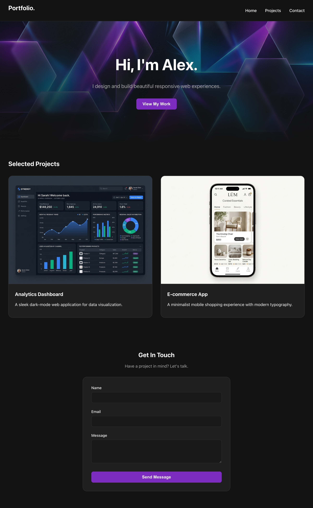

# Portfolio Website (Assignment 1)

## Project Description
**Goal:** Design and develop responsive web pages using HTML, CSS, and modern layout techniques with interactive elements.

**Requirements:**
- Look good on both mobile and desktop
- Use HTML for structure
- Use CSS for styling
- Use modern layouts like Flexbox and CSS Grid
- Add interactive elements such as buttons, forms, menus, animations, and hover effects

**Example Criteria:**
Build a portfolio website where:
- The navigation menu adjusts for mobile screens.
- Images resize automatically.
- Buttons change color when hovered over.
- A contact form accepts user input.

---

## What We Implemented

For this assignment, we built a modern, responsive portfolio application using **React** and **Vanilla CSS**. The design features a premium "dark mode" aesthetic with glassmorphism elements.

### Key Features:
1. **Responsive Navigation:** 
   - Built using CSS Flexbox. It automatically stacks and centers navigation links on smaller mobile screens (`max-width: 600px`).
2. **Modern Layouts:**
   - **CSS Grid** is used in the Projects section (`grid-template-columns: repeat(auto-fit, minmax(300px, 1fr))`) to create a fluid layout where project cards automatically wrap and expand based on the screen size.
3. **Interactive Elements:**
   - **Buttons** feature hover effects with a scale transform and drop-shadow (`transition: all 0.3s ease; transform: translateY(-2px);`).
   - **Project Cards** elevate smoothly and brighten their borders when hovered over.
4. **Responsive Images:**
   - Images automatically adapt to the grid size and maintain their aspect ratio using `aspect-ratio: 4/3` and `object-fit: cover`.
5. **Functional Contact Form:**
   - A fully styled form that accepts Name, Email, and Message. It sits on a glassmorphism backdrop (`backdrop-filter: blur(12px)`) for a modern, sleek appearance.

## Final Output

